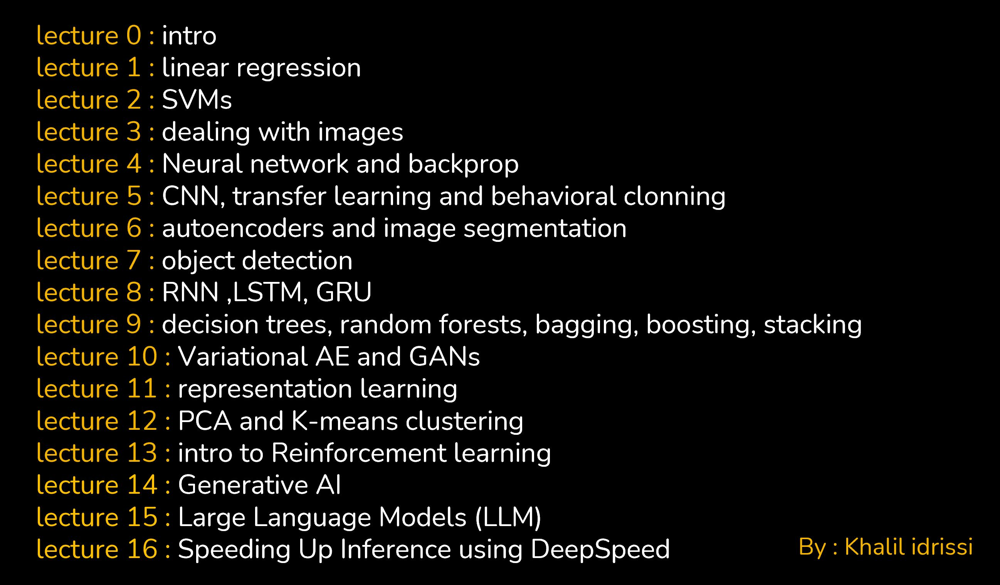
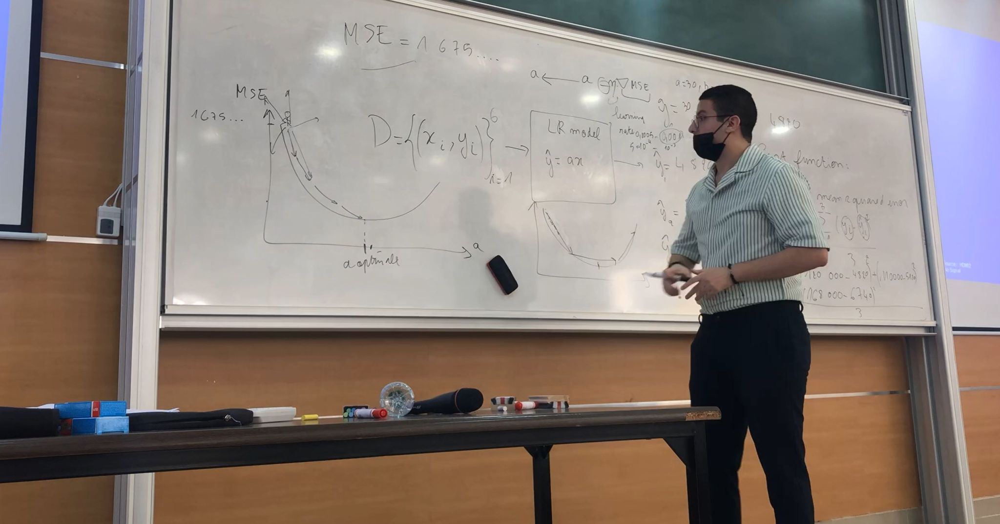
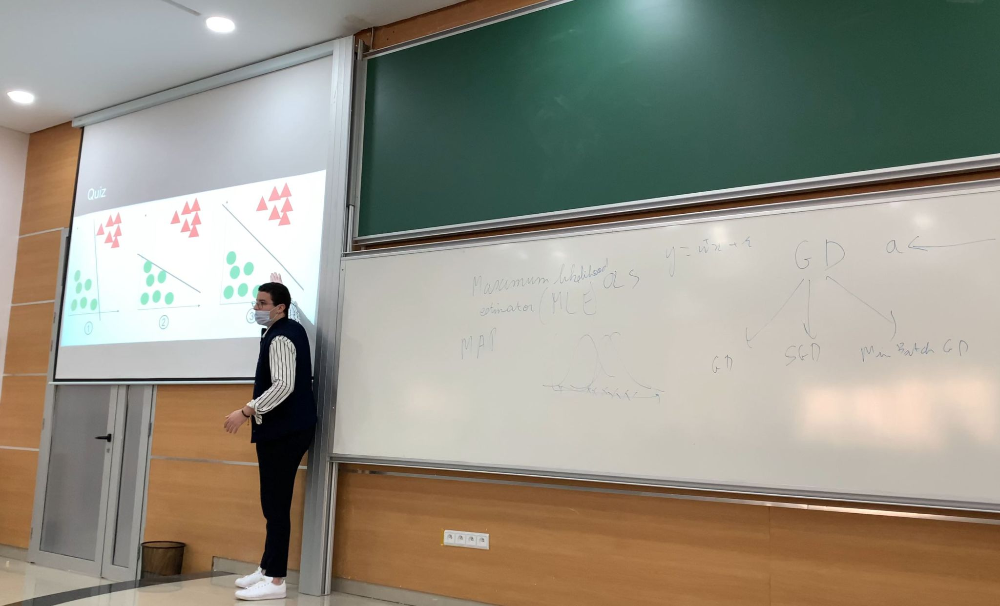
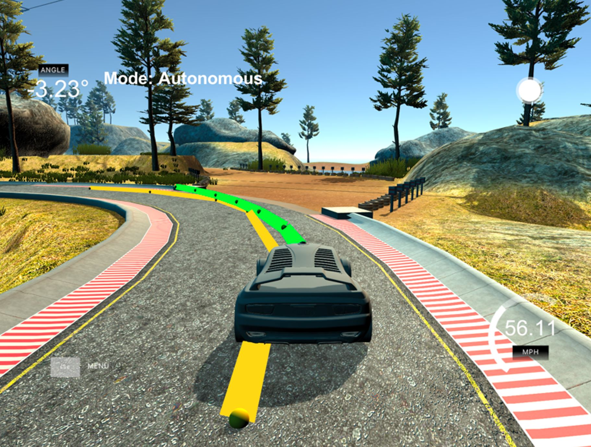
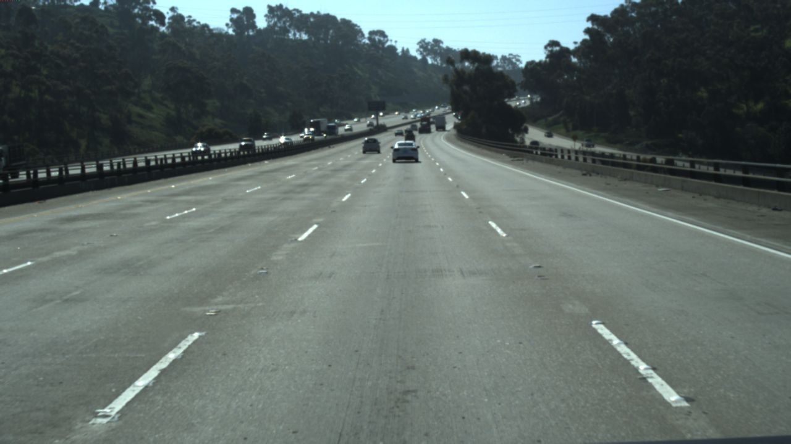
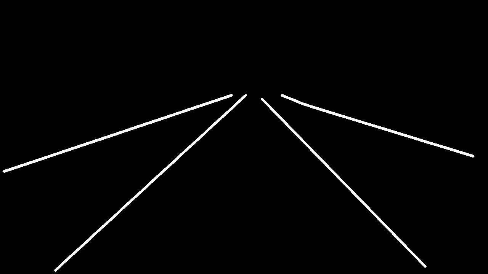

# AI-course
## Introduction

Welcome to this comprehensive AI Lectures repository! This resource is designed for learners at all levels interested in exploring the world of Artificial Intelligence (AI). It provides a detailed series of lectures, starting from the basics and advancing to more complex topics. Whether you are a beginner or have some experience in AI, this repository will enhance your understanding and skills.

## Lecture Overview

- **Lecture 0:** Introduction to AI - A foundational start for the entire course.
- **Lecture 1:** Linear Regression - Understanding the basics of statistical modeling.
- **Lecture 2:** Support Vector Machine (SVM) - Delving into classification algorithms.
- **Lecture 3:** Image Handling - Techniques for processing and manipulating images.
- **Lecture 4:** Artificial Neural Networks (ANN) - Exploring the basics of neural networks.
- **Lecture 5:** Convolutional Neural Networks (CNN) - Specialized deep learning for image processing.
- **Lecture 6:** Semantic Segmentation and Autoencoders - Advanced techniques for image analysis.
- **Lecture 7:** Object Detection with YOLO - Implementing a cutting-edge object detection model.
- **Lecture 8:** RNN, LSTM, GRU - Understanding recurrent neural networks and variants.
- **Lecture 9:** Decision Trees, Random Forests, and Ensemble Methods - Comprehensive study of tree-based models and ensemble techniques.
- **Lecture 10:** Variational Autoencoders (VAE) and Generative Adversarial Networks (GANs) - Exploring generative models.
- **Lecture 11:** Representation Learning - Techniques for learning useful data representations.
- **Lecture 12:** PCA and K-Means Clustering - Unsupervised learning methods for data analysis.
- **Lecture 13:** Introduction to Reinforcement Learning - Basics of AI that learns from interactions.
- **Lecture 14:** Generative AI - Understanding AI that can generate novel content.
- **Lecture 15:** Large Language Models (LLM) - Exploring the world of advanced language processing.
- **Lecture 16:** Speeding Up Inference using DeepSpeed - Techniques for optimizing AI model performance.




### Key Features:
- **In-Depth Lectures:** From introductory concepts to advanced topics.





- **Practical Code Examples:** Every lecture ends with a coding session.

  


- **Frameworks & Libraries:** Primarily uses PyTorch, with practical applications in various AI domains.
- **Autonomous Driving Car Project:** Includes code for an autonomous driving car, converted from Keras to PyTorch.
  


- **Lane Detection using Semantic Segmentation:** A practical implementation demonstrating semantic segmentation.

<div style="display: flex;">
    
    
</div>


### Upcoming Lectures
- Lectures on advanced topics are being prepared and will be added soon.

## Installation Requirements

To fully benefit from this repository, you will need to install several libraries and frameworks:

```bash
pip install pandas
pip install scikit-learn
pip install torch torchvision
pip install opencv-python
pip install numpy
